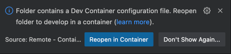
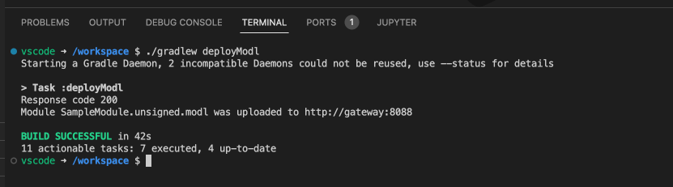
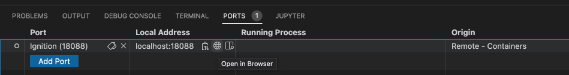
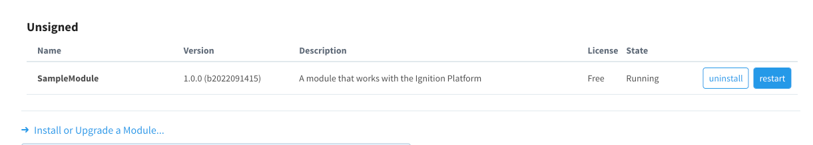

# Dev Container for Ignition Module Development

![Ignition 8.1.42](https://img.shields.io/badge/ignition-8.1.42-brightgreen.svg?logo=data:image/png;base64,iVBORw0KGgoAAAANSUhEUgAAADAAAAAwCAYAAABXAvmHAAAEt2lUWHRYTUw6Y29tLmFkb2JlLnhtcAAAAAAAPD94cGFja2V0IGJlZ2luPSLvu78iIGlkPSJXNU0wTXBDZWhpSHpyZVN6TlRjemtjOWQiPz4KPHg6eG1wbWV0YSB4bWxuczp4PSJhZG9iZTpuczptZXRhLyIgeDp4bXB0az0iWE1QIENvcmUgNS41LjAiPgogPHJkZjpSREYgeG1sbnM6cmRmPSJodHRwOi8vd3d3LnczLm9yZy8xOTk5LzAyLzIyLXJkZi1zeW50YXgtbnMjIj4KICA8cmRmOkRlc2NyaXB0aW9uIHJkZjphYm91dD0iIgogICAgeG1sbnM6dGlmZj0iaHR0cDovL25zLmFkb2JlLmNvbS90aWZmLzEuMC8iCiAgICB4bWxuczpleGlmPSJodHRwOi8vbnMuYWRvYmUuY29tL2V4aWYvMS4wLyIKICAgIHhtbG5zOnBob3Rvc2hvcD0iaHR0cDovL25zLmFkb2JlLmNvbS9waG90b3Nob3AvMS4wLyIKICAgIHhtbG5zOnhtcD0iaHR0cDovL25zLmFkb2JlLmNvbS94YXAvMS4wLyIKICAgIHhtbG5zOnhtcE1NPSJodHRwOi8vbnMuYWRvYmUuY29tL3hhcC8xLjAvbW0vIgogICAgeG1sbnM6c3RFdnQ9Imh0dHA6Ly9ucy5hZG9iZS5jb20veGFwLzEuMC9zVHlwZS9SZXNvdXJjZUV2ZW50IyIKICAgdGlmZjpJbWFnZUxlbmd0aD0iNDgiCiAgIHRpZmY6SW1hZ2VXaWR0aD0iNDgiCiAgIHRpZmY6UmVzb2x1dGlvblVuaXQ9IjIiCiAgIHRpZmY6WFJlc29sdXRpb249IjcyLjAiCiAgIHRpZmY6WVJlc29sdXRpb249IjcyLjAiCiAgIGV4aWY6UGl4ZWxYRGltZW5zaW9uPSI0OCIKICAgZXhpZjpQaXhlbFlEaW1lbnNpb249IjQ4IgogICBleGlmOkNvbG9yU3BhY2U9IjEiCiAgIHBob3Rvc2hvcDpDb2xvck1vZGU9IjMiCiAgIHBob3Rvc2hvcDpJQ0NQcm9maWxlPSJzUkdCIElFQzYxOTY2LTIuMSIKICAgeG1wOk1vZGlmeURhdGU9IjIwMjAtMTEtMTVUMjE6MTQ6NDctMDY6MDAiCiAgIHhtcDpNZXRhZGF0YURhdGU9IjIwMjAtMTEtMTVUMjE6MTQ6NDctMDY6MDAiPgogICA8eG1wTU06SGlzdG9yeT4KICAgIDxyZGY6U2VxPgogICAgIDxyZGY6bGkKICAgICAgc3RFdnQ6YWN0aW9uPSJwcm9kdWNlZCIKICAgICAgc3RFdnQ6c29mdHdhcmVBZ2VudD0iQWZmaW5pdHkgUGhvdG8gKE5vdiAgNiAyMDIwKSIKICAgICAgc3RFdnQ6d2hlbj0iMjAyMC0xMS0xNVQyMToxNDo0Ny0wNjowMCIvPgogICAgPC9yZGY6U2VxPgogICA8L3htcE1NOkhpc3Rvcnk+CiAgPC9yZGY6RGVzY3JpcHRpb24+CiA8L3JkZjpSREY+CjwveDp4bXBtZXRhPgo8P3hwYWNrZXQgZW5kPSJyIj8+cMqVDwAAAYFpQ0NQc1JHQiBJRUM2MTk2Ni0yLjEAACiRdZHPK0RRFMc/ZoiMX8XCwuIlrIYGJTbKTBpqksYog83M82ZGzYzXeyPJVtlOUWLj14K/gK2yVopIycrCmtgwPecaNZI5t3PP537vPad7zwVXJK1n7EofZLI5Kxz0azPRWa36CQ9NuGnAE9Ntc2RyMkRZe7+lQsXrblWr/Ll/zbNg2DpU1AgP66aVEx4TDq3kTMVbwi16KrYgfCLsteSCwjdKjxf5WXGyyJ+KrUg4AK4mYS35i+O/WE9ZGWF5OR2Z9LL+cx/1kjojOz0lsV28DZswQfxojDNKgAF6GZJ5gG766JEVZfJ93/kTLEmuLrPJKhaLJEmRwyvqslQ3JCZEN2SkWVX9/9tXO9HfV6xe54eqR8d57YTqTSjkHefjwHEKh+B+gPNsKX9pHwbfRM+XtI49aFyH04uSFt+Gsw1ovTdjVuxbcou7Egl4OYb6KDRfQe1csWc/+xzdQWRNvuoSdnahS843zn8B7IhnrjeRmuAAAAAJcEhZcwAACxMAAAsTAQCanBgAAAQkSURBVGiBzdrdqxVlFAbwn2YfI2nHsLQuhiAqqCj7IImCEoo+BEWSyiKyhFBOwoRgYAgFJUKUQ2FFRn9AViBoVIQS566LtIu6qCCawDK1RKIxjnm6mDmd3ZyZvWfmnPbZz9We9a5Z73rm/VprvXuWAUMah/PxEtbiLOzHKxgJouR0UX92X73rgTQO5+AjDON8BFiOT/F42TsDRQB34BbMKsjnYEcah1cVXxgYAmkczsZmnF2hMg8risKBIYA7cVcPnWNFwUAQSONwFjbq7s8R7CkKB4IA5uv+9cewJYiS34oNg0LgHdmuU4VDeK+sobja+440Dq/G111UjmBJECW/lDUOwgg81KP95SrnmWECaRwOYX0Xlb3Y2c3GjBHId57NuLhC5Rg2BlFyqpudmRyBIazp0v4sfuxlZM60udMc9yOsaNsdRMm7dYzMyAikcTgXr1X0fwpb6tqaqSm0BheWyEfxYBAl39c1NFMEnqiQ78XHTQz1/SBL43CZLEkp4ndcFkTJySb2+joCaRwGiEuazmB9U+fp/xRagklJiWzafNjGYL8JRDi3IPsWq8vy3TooPQfyU/J63ISj2BdEyd9tOuiwuQQPFMRj2BpESdrW7qQRyJ1/DgdlYe4e7EnjsCrVq4tIVmUYxxjeCqKkNEyui7IptBRbC7LluKdtJ3m14b6C+DCeb2tzHGUEbsU5JfLVU+jnBf8N2v7E2iBKfp2CTZQTOFChuzKfXo2QxuElJocGbwZR8llTW2WYRCCIkkP4oER3SDaVmmJl4fk7bG9hpxRV2+g2lO0Ma5qMQr7whztEJ7EqiJJJ5ZG2qCJwEOtkO0UnbsTcBvYfwbUdz2/jmwbv90QpgSBKxvA+9hWaFmNBHcNpHJ6HpztEn8v2/OJHmRIqT+IgSkZlFeKfO8RDuKam7StwXf57FJt6pYdt0DWUCKLkOJ5E5yncLQ3sxE4T2/FGfNnYuxrouSDzout2bJIRPoHFQZT81eWd2zGSP34SRMm90+BrKXoGc0GUnAmiZLOJGH7IxNSowngtfxQb2rvXG02i0Q0YPzmXVimlcbhQdmqfxrogSn5o715v1CaQ56mPypLum8t08jNim2yURrB7Gnzsiqb5wH68gRsq2i/FKlmgtuL/2HWKaEQgiJIzsoLTwxUqh3E3Hgui5I8p+lYLU0rq0zichwvyxxP9croTrQjkc/0pPIOLcjtH8Sp25SPVF7QtLW7BiwXZArwui5V2TMWpJmgT3y/CT6pvE8kuJL5q7VUDtKlKDOvuPNlC7gvaELi8hs7CFnZboQ2BOvF85ZXQdKPNIt4lK5FUfeVTsiIt/v3zxm04HkTJFy3664rGI5BXEraiLBodrzZ0lseHsAhXtvKwB9qWFnfJ/pgxYiLtPIBlJsc/x2X3XdOaSo7jH8bM+Sebu28XAAAAAElFTkSuQmCC)

This solution provides a [Development Container][1] with a complete Ignition Module SDK development environment.

**Features:**

* 📦 Containerized with all required dependencies pre-installed.
* 🔌 VSCode Gradle and Java Extensions installed.
* ☕️ Ignition Sidecar Container with Debugging and Module Hot-loading enabled.

## Getting Started

There are only a few prerequisites to get started with Ignition Module Development using this solution:

* Docker
* [Visual Studio Code][2]
* [Visual Studio Code Remote Containers Extension][3]

## Usage

There is some automatic scaffolding done the very first time you open this solution in a Devcontainer with VSCode.  If you want to customize some of the base scaffolding, modify the role defaults file at `.devcontainer/roles/ignition-module-devcontainer/defaults/main.yml`.

Once you're happy with the values here, you can open the solution in a container by invoking the Command Palette (<kbd>Ctrl</kbd>-<kbd>Shift</kbd>-<kbd>P</kbd> (Windows/Linux) or <kbd>Cmd</kbd>-<kbd>Shift</kbd>-<kbd>P</kbd> (macOS)) and selecting _Remote-Containers: Rebuild and Reopen in Container_.

It will take a few minutes for the development container to build and open, followed by initialization of the Java and Gradle VSCode extensions.  Once everything finally settles out, you should be able to start development on your module.  

As part of this solution, a sidecar container with Ignition will be deployed.  This Ignition Gateway is setup for remote debugging as well as loading of unsigned development modules.  You can deploy your module to the running gateway by running the `deployModl` task (either from the Gradle extension on the left-hand side of VSCode or by running `./gradlew deployModl` in the terminal).

Once completed, you can then inspect the Gateway Web UI by opening the forwarded port in the _Ports_ section in VSCode.  Hit <kbd>Ctrl</kbd>-<kbd>`</kbd> to toggle the view of the bottom window if necessary.  You can open the forwarded port shown by clicking on the 🌐 icon.

Navigate to _Config->Modules_ and observe that your module has been built and loaded into the running Ignition gateway.  Note the URL above--this can be used to connect a Designer and conduct additional testing.

## Shutting down

In order to stop the dev container simply close the VSCode window.  The dev container and the associated Ignition sidecar will shutdown and be in a _stopped_ state.  Resuming from this state will be much quicker than the initial setup/provisioning process.

<!-- Links -->
[1]: https://containers.dev
[2]: https://code.visualstudio.com/
[3]: https://marketplace.visualstudio.com/items?itemName=ms-vscode-remote.remote-containers
